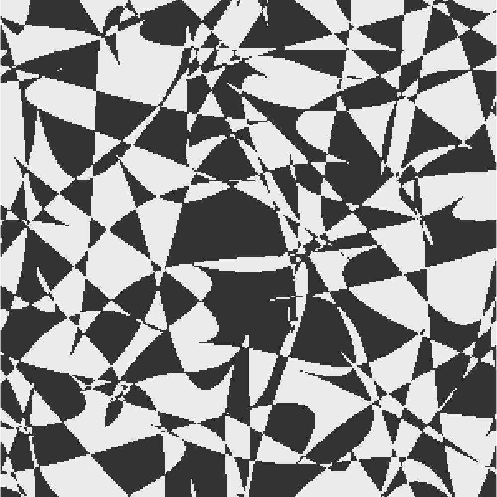

<!-- README.md -->
# Welcome to the Digital Canvas of @jams2blues

  

I’m @jams2blues—an internationally exhibited artist, world record-holding guitarist, and the innovative lead singer of [@quantaphoria](https://twitter.com/quantaphoria). With a philosophy of **"Save The World With Art™"**, I fuse avant-garde digital art, cutting-edge Web3 technology, and live performance to redefine creative expression.

**What You’ll Discover:**
- **Generative Art & NFT Mastery:** Inspired by my one-of-a-kind piece, *Counterchange Tessellation: Abundance*, witness a dynamic display of fractal beauty and on-chain art.
- **Record-Breaking Performances:** Experience the legacy of my 25-hour 15-minute nonstop, improvised guitar solo.
- **Innovative Projects:** Explore a range of projects—from SVG-Animation-Creator to fully on-chain minting platforms—that push the boundaries of art and technology.
- **Interactive Engagement:** Enjoy a live, interactive terminal, real-time GitHub stats, and a vibrant social feed.
- **Digital Showcase:** Visit my [Linktree](https://linktr.ee/jams2blues) to access my FOC NFTs, Web3 tools, and more.

[Experience the full interactive profile →](https://jams2blues.github.io/jams2blues/)
